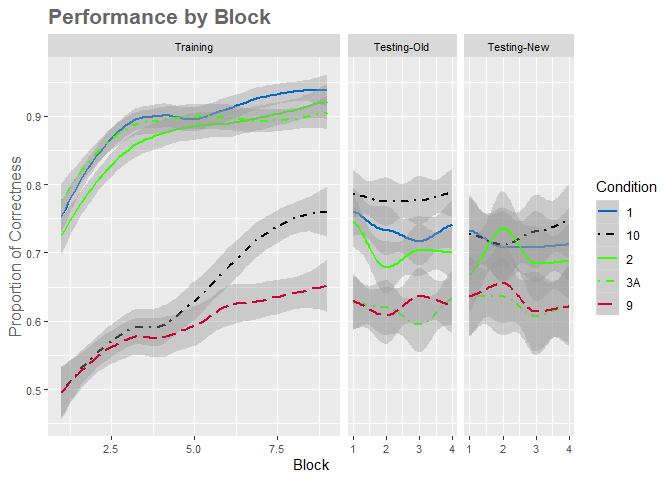
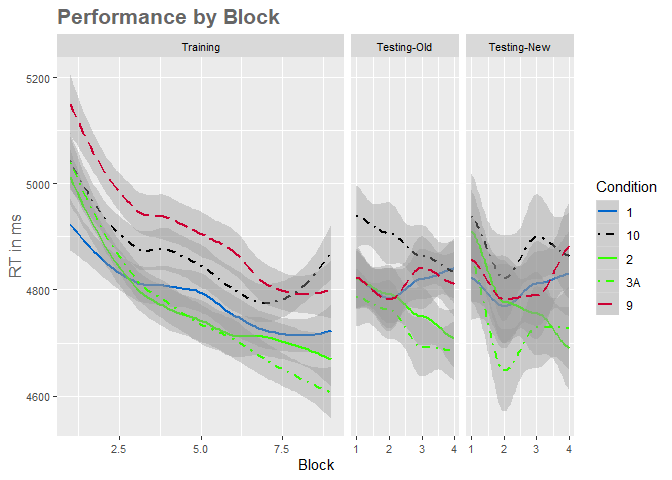

#Pilot data exploration

####Loading Libraries

```r
library(data.table)
library(tidyverse)
```

```
## -- Attaching packages ------------------------------------------------------------------------------------------------------------------------------------ tidyverse 1.2.1 --
```

```
## v ggplot2 3.2.1     v purrr   0.3.3
## v tibble  2.1.3     v dplyr   0.8.3
## v tidyr   1.0.0     v stringr 1.4.0
## v readr   1.3.1     v forcats 0.4.0
```

```
## -- Conflicts --------------------------------------------------------------------------------------------------------------------------------------- tidyverse_conflicts() --
## x dplyr::between()   masks data.table::between()
## x dplyr::filter()    masks stats::filter()
## x dplyr::first()     masks data.table::first()
## x dplyr::lag()       masks stats::lag()
## x dplyr::last()      masks data.table::last()
## x purrr::transpose() masks data.table::transpose()
```

```r
library(ggthemes)
library(outliers)
library(lme4)
```

```
## Loading required package: Matrix
```

```
## 
## Attaching package: 'Matrix'
```

```
## The following objects are masked from 'package:tidyr':
## 
##     expand, pack, unpack
```

```r
library(lmerTest)
```

```
## 
## Attaching package: 'lmerTest'
```

```
## The following object is masked from 'package:lme4':
## 
##     lmer
```

```
## The following object is masked from 'package:stats':
## 
##     step
```

```r
library(afex)
```

```
## Registered S3 methods overwritten by 'car':
##   method                          from
##   influence.merMod                lme4
##   cooks.distance.influence.merMod lme4
##   dfbeta.influence.merMod         lme4
##   dfbetas.influence.merMod        lme4
```

```
## ************
## Welcome to afex. For support visit: http://afex.singmann.science/
```

```
## - Functions for ANOVAs: aov_car(), aov_ez(), and aov_4()
## - Methods for calculating p-values with mixed(): 'KR', 'S', 'LRT', and 'PB'
## - 'afex_aov' and 'mixed' objects can be passed to emmeans() for follow-up tests
## - NEWS: library('emmeans') now needs to be called explicitly!
## - Get and set global package options with: afex_options()
## - Set orthogonal sum-to-zero contrasts globally: set_sum_contrasts()
## - For example analyses see: browseVignettes("afex")
## ************
```

```
## 
## Attaching package: 'afex'
```

```
## The following object is masked from 'package:lme4':
## 
##     lmer
```

```r
library(kableExtra)
```

```
## 
## Attaching package: 'kableExtra'
```

```
## The following object is masked from 'package:dplyr':
## 
##     group_rows
```

```r
library(agricolae)
library(multcomp)
```

```
## Loading required package: mvtnorm
```

```
## Loading required package: survival
```

```
## Loading required package: TH.data
```

```
## Loading required package: MASS
```

```
## 
## Attaching package: 'MASS'
```

```
## The following object is masked from 'package:dplyr':
## 
##     select
```

```
## 
## Attaching package: 'TH.data'
```

```
## The following object is masked from 'package:MASS':
## 
##     geyser
```

```r
library(devtools)
```

```
## Loading required package: usethis
```

####Plotting Correctness through Trial type (it works with CleanData4!!!)

```r
DataNew <- read.csv("D:/WIN/Documents/GitHub/Stekic-et-al/Data/CleanData4.csv")

DataSubset <- subset(DataNew, Condition == "1"|Condition == "2"|Condition == "3A"|Condition == "10"| Condition == "9")

DataSubset$TrialType2 = factor(DataSubset$TrialType2, levels=c("Training","Testing-Old","Testing-New"), labels=c("Training","Testing-Old","Testing-New")) 

ggplot(DataSubset, aes(x= Block, y= RespCorr, colour= Condition, linetype = Condition)) + 
  geom_smooth(aes(colour = Condition),size = 1.0,se = TRUE, method= 'loess', formula =  y~x)+
  
  scale_linetype_manual(values = c("solid", "dotdash",
                                    "solid", "dotdash",
                                    "longdash")) +
  
  scale_color_manual(values= c("#0066CC", "#000000",
                               "#33FF00", "#33FF00", 
                                "#CC0033")) +
                               
  ggtitle("Performance by Block") +
  labs(x="Block", y="Proportion of Correctness") +
  facet_grid(~TrialType2, scales="free", space= "free_x" ) +
  theme(axis.title.y = element_text(size=12,  color="#666666")) +
  theme(axis.text = element_text(size=8)) +
  theme(plot.title = element_text(size=16, face="bold", hjust=0, color="#666666")) +
  theme(strip.text.x = element_text(size = 8, colour = "black"))
```

```
## Warning in simpleLoess(y, x, w, span, degree = degree, parametric =
## parametric, : pseudoinverse used at 0.985
```

```
## Warning in simpleLoess(y, x, w, span, degree = degree, parametric =
## parametric, : neighborhood radius 2.015
```

```
## Warning in simpleLoess(y, x, w, span, degree = degree, parametric =
## parametric, : reciprocal condition number 4.6241e-015
```

```
## Warning in simpleLoess(y, x, w, span, degree = degree, parametric =
## parametric, : There are other near singularities as well. 4.0602
```

```
## Warning in predLoess(object$y, object$x, newx = if
## (is.null(newdata)) object$x else if (is.data.frame(newdata))
## as.matrix(model.frame(delete.response(terms(object)), : pseudoinverse used
## at 0.985
```

```
## Warning in predLoess(object$y, object$x, newx = if
## (is.null(newdata)) object$x else if (is.data.frame(newdata))
## as.matrix(model.frame(delete.response(terms(object)), : neighborhood radius
## 2.015
```

```
## Warning in predLoess(object$y, object$x, newx = if
## (is.null(newdata)) object$x else if (is.data.frame(newdata))
## as.matrix(model.frame(delete.response(terms(object)), : reciprocal
## condition number 4.6241e-015
```

```
## Warning in predLoess(object$y, object$x, newx = if
## (is.null(newdata)) object$x else if (is.data.frame(newdata))
## as.matrix(model.frame(delete.response(terms(object)), : There are other
## near singularities as well. 4.0602
```

```
## Warning in simpleLoess(y, x, w, span, degree = degree, parametric =
## parametric, : pseudoinverse used at 0.985
```

```
## Warning in simpleLoess(y, x, w, span, degree = degree, parametric =
## parametric, : neighborhood radius 2.015
```

```
## Warning in simpleLoess(y, x, w, span, degree = degree, parametric =
## parametric, : reciprocal condition number 4.2768e-015
```

```
## Warning in simpleLoess(y, x, w, span, degree = degree, parametric =
## parametric, : There are other near singularities as well. 4.0602
```

```
## Warning in predLoess(object$y, object$x, newx = if
## (is.null(newdata)) object$x else if (is.data.frame(newdata))
## as.matrix(model.frame(delete.response(terms(object)), : pseudoinverse used
## at 0.985
```

```
## Warning in predLoess(object$y, object$x, newx = if
## (is.null(newdata)) object$x else if (is.data.frame(newdata))
## as.matrix(model.frame(delete.response(terms(object)), : neighborhood radius
## 2.015
```

```
## Warning in predLoess(object$y, object$x, newx = if
## (is.null(newdata)) object$x else if (is.data.frame(newdata))
## as.matrix(model.frame(delete.response(terms(object)), : reciprocal
## condition number 4.2768e-015
```

```
## Warning in predLoess(object$y, object$x, newx = if
## (is.null(newdata)) object$x else if (is.data.frame(newdata))
## as.matrix(model.frame(delete.response(terms(object)), : There are other
## near singularities as well. 4.0602
```

```
## Warning in simpleLoess(y, x, w, span, degree = degree, parametric =
## parametric, : pseudoinverse used at 0.985
```

```
## Warning in simpleLoess(y, x, w, span, degree = degree, parametric =
## parametric, : neighborhood radius 2.015
```

```
## Warning in simpleLoess(y, x, w, span, degree = degree, parametric =
## parametric, : reciprocal condition number 9.4315e-015
```

```
## Warning in simpleLoess(y, x, w, span, degree = degree, parametric =
## parametric, : There are other near singularities as well. 4.0602
```

```
## Warning in predLoess(object$y, object$x, newx = if
## (is.null(newdata)) object$x else if (is.data.frame(newdata))
## as.matrix(model.frame(delete.response(terms(object)), : pseudoinverse used
## at 0.985
```

```
## Warning in predLoess(object$y, object$x, newx = if
## (is.null(newdata)) object$x else if (is.data.frame(newdata))
## as.matrix(model.frame(delete.response(terms(object)), : neighborhood radius
## 2.015
```

```
## Warning in predLoess(object$y, object$x, newx = if
## (is.null(newdata)) object$x else if (is.data.frame(newdata))
## as.matrix(model.frame(delete.response(terms(object)), : reciprocal
## condition number 9.4315e-015
```

```
## Warning in predLoess(object$y, object$x, newx = if
## (is.null(newdata)) object$x else if (is.data.frame(newdata))
## as.matrix(model.frame(delete.response(terms(object)), : There are other
## near singularities as well. 4.0602
```

```
## Warning in simpleLoess(y, x, w, span, degree = degree, parametric =
## parametric, : pseudoinverse used at 0.985
```

```
## Warning in simpleLoess(y, x, w, span, degree = degree, parametric =
## parametric, : neighborhood radius 2.015
```

```
## Warning in simpleLoess(y, x, w, span, degree = degree, parametric =
## parametric, : reciprocal condition number 4.3096e-015
```

```
## Warning in simpleLoess(y, x, w, span, degree = degree, parametric =
## parametric, : There are other near singularities as well. 4.0602
```

```
## Warning in predLoess(object$y, object$x, newx = if
## (is.null(newdata)) object$x else if (is.data.frame(newdata))
## as.matrix(model.frame(delete.response(terms(object)), : pseudoinverse used
## at 0.985
```

```
## Warning in predLoess(object$y, object$x, newx = if
## (is.null(newdata)) object$x else if (is.data.frame(newdata))
## as.matrix(model.frame(delete.response(terms(object)), : neighborhood radius
## 2.015
```

```
## Warning in predLoess(object$y, object$x, newx = if
## (is.null(newdata)) object$x else if (is.data.frame(newdata))
## as.matrix(model.frame(delete.response(terms(object)), : reciprocal
## condition number 4.3096e-015
```

```
## Warning in predLoess(object$y, object$x, newx = if
## (is.null(newdata)) object$x else if (is.data.frame(newdata))
## as.matrix(model.frame(delete.response(terms(object)), : There are other
## near singularities as well. 4.0602
```

```
## Warning in simpleLoess(y, x, w, span, degree = degree, parametric =
## parametric, : pseudoinverse used at 0.985
```

```
## Warning in simpleLoess(y, x, w, span, degree = degree, parametric =
## parametric, : neighborhood radius 2.015
```

```
## Warning in simpleLoess(y, x, w, span, degree = degree, parametric =
## parametric, : reciprocal condition number 4.2768e-015
```

```
## Warning in simpleLoess(y, x, w, span, degree = degree, parametric =
## parametric, : There are other near singularities as well. 4.0602
```

```
## Warning in predLoess(object$y, object$x, newx = if
## (is.null(newdata)) object$x else if (is.data.frame(newdata))
## as.matrix(model.frame(delete.response(terms(object)), : pseudoinverse used
## at 0.985
```

```
## Warning in predLoess(object$y, object$x, newx = if
## (is.null(newdata)) object$x else if (is.data.frame(newdata))
## as.matrix(model.frame(delete.response(terms(object)), : neighborhood radius
## 2.015
```

```
## Warning in predLoess(object$y, object$x, newx = if
## (is.null(newdata)) object$x else if (is.data.frame(newdata))
## as.matrix(model.frame(delete.response(terms(object)), : reciprocal
## condition number 4.2768e-015
```

```
## Warning in predLoess(object$y, object$x, newx = if
## (is.null(newdata)) object$x else if (is.data.frame(newdata))
## as.matrix(model.frame(delete.response(terms(object)), : There are other
## near singularities as well. 4.0602
```

```
## Warning in simpleLoess(y, x, w, span, degree = degree, parametric =
## parametric, : pseudoinverse used at 0.985
```

```
## Warning in simpleLoess(y, x, w, span, degree = degree, parametric =
## parametric, : neighborhood radius 2.015
```

```
## Warning in simpleLoess(y, x, w, span, degree = degree, parametric =
## parametric, : reciprocal condition number 2.8115e-015
```

```
## Warning in simpleLoess(y, x, w, span, degree = degree, parametric =
## parametric, : There are other near singularities as well. 4.0602
```

```
## Warning in predLoess(object$y, object$x, newx = if
## (is.null(newdata)) object$x else if (is.data.frame(newdata))
## as.matrix(model.frame(delete.response(terms(object)), : pseudoinverse used
## at 0.985
```

```
## Warning in predLoess(object$y, object$x, newx = if
## (is.null(newdata)) object$x else if (is.data.frame(newdata))
## as.matrix(model.frame(delete.response(terms(object)), : neighborhood radius
## 2.015
```

```
## Warning in predLoess(object$y, object$x, newx = if
## (is.null(newdata)) object$x else if (is.data.frame(newdata))
## as.matrix(model.frame(delete.response(terms(object)), : reciprocal
## condition number 2.8115e-015
```

```
## Warning in predLoess(object$y, object$x, newx = if
## (is.null(newdata)) object$x else if (is.data.frame(newdata))
## as.matrix(model.frame(delete.response(terms(object)), : There are other
## near singularities as well. 4.0602
```

```
## Warning in simpleLoess(y, x, w, span, degree = degree, parametric =
## parametric, : pseudoinverse used at 0.985
```

```
## Warning in simpleLoess(y, x, w, span, degree = degree, parametric =
## parametric, : neighborhood radius 2.015
```

```
## Warning in simpleLoess(y, x, w, span, degree = degree, parametric =
## parametric, : reciprocal condition number 2.8005e-015
```

```
## Warning in simpleLoess(y, x, w, span, degree = degree, parametric =
## parametric, : There are other near singularities as well. 4.0602
```

```
## Warning in predLoess(object$y, object$x, newx = if
## (is.null(newdata)) object$x else if (is.data.frame(newdata))
## as.matrix(model.frame(delete.response(terms(object)), : pseudoinverse used
## at 0.985
```

```
## Warning in predLoess(object$y, object$x, newx = if
## (is.null(newdata)) object$x else if (is.data.frame(newdata))
## as.matrix(model.frame(delete.response(terms(object)), : neighborhood radius
## 2.015
```

```
## Warning in predLoess(object$y, object$x, newx = if
## (is.null(newdata)) object$x else if (is.data.frame(newdata))
## as.matrix(model.frame(delete.response(terms(object)), : reciprocal
## condition number 2.8005e-015
```

```
## Warning in predLoess(object$y, object$x, newx = if
## (is.null(newdata)) object$x else if (is.data.frame(newdata))
## as.matrix(model.frame(delete.response(terms(object)), : There are other
## near singularities as well. 4.0602
```

```
## Warning in simpleLoess(y, x, w, span, degree = degree, parametric =
## parametric, : pseudoinverse used at 0.985
```

```
## Warning in simpleLoess(y, x, w, span, degree = degree, parametric =
## parametric, : neighborhood radius 2.015
```

```
## Warning in simpleLoess(y, x, w, span, degree = degree, parametric =
## parametric, : reciprocal condition number 2.8981e-015
```

```
## Warning in simpleLoess(y, x, w, span, degree = degree, parametric =
## parametric, : There are other near singularities as well. 4.0602
```

```
## Warning in predLoess(object$y, object$x, newx = if
## (is.null(newdata)) object$x else if (is.data.frame(newdata))
## as.matrix(model.frame(delete.response(terms(object)), : pseudoinverse used
## at 0.985
```

```
## Warning in predLoess(object$y, object$x, newx = if
## (is.null(newdata)) object$x else if (is.data.frame(newdata))
## as.matrix(model.frame(delete.response(terms(object)), : neighborhood radius
## 2.015
```

```
## Warning in predLoess(object$y, object$x, newx = if
## (is.null(newdata)) object$x else if (is.data.frame(newdata))
## as.matrix(model.frame(delete.response(terms(object)), : reciprocal
## condition number 2.8981e-015
```

```
## Warning in predLoess(object$y, object$x, newx = if
## (is.null(newdata)) object$x else if (is.data.frame(newdata))
## as.matrix(model.frame(delete.response(terms(object)), : There are other
## near singularities as well. 4.0602
```

```
## Warning in simpleLoess(y, x, w, span, degree = degree, parametric =
## parametric, : pseudoinverse used at 0.985
```

```
## Warning in simpleLoess(y, x, w, span, degree = degree, parametric =
## parametric, : neighborhood radius 2.015
```

```
## Warning in simpleLoess(y, x, w, span, degree = degree, parametric =
## parametric, : reciprocal condition number 1.1692e-015
```

```
## Warning in simpleLoess(y, x, w, span, degree = degree, parametric =
## parametric, : There are other near singularities as well. 4.0602
```

```
## Warning in predLoess(object$y, object$x, newx = if
## (is.null(newdata)) object$x else if (is.data.frame(newdata))
## as.matrix(model.frame(delete.response(terms(object)), : pseudoinverse used
## at 0.985
```

```
## Warning in predLoess(object$y, object$x, newx = if
## (is.null(newdata)) object$x else if (is.data.frame(newdata))
## as.matrix(model.frame(delete.response(terms(object)), : neighborhood radius
## 2.015
```

```
## Warning in predLoess(object$y, object$x, newx = if
## (is.null(newdata)) object$x else if (is.data.frame(newdata))
## as.matrix(model.frame(delete.response(terms(object)), : reciprocal
## condition number 1.1692e-015
```

```
## Warning in predLoess(object$y, object$x, newx = if
## (is.null(newdata)) object$x else if (is.data.frame(newdata))
## as.matrix(model.frame(delete.response(terms(object)), : There are other
## near singularities as well. 4.0602
```

```
## Warning in simpleLoess(y, x, w, span, degree = degree, parametric =
## parametric, : pseudoinverse used at 0.985
```

```
## Warning in simpleLoess(y, x, w, span, degree = degree, parametric =
## parametric, : neighborhood radius 2.015
```

```
## Warning in simpleLoess(y, x, w, span, degree = degree, parametric =
## parametric, : reciprocal condition number 2.8005e-015
```

```
## Warning in simpleLoess(y, x, w, span, degree = degree, parametric =
## parametric, : There are other near singularities as well. 4.0602
```

```
## Warning in predLoess(object$y, object$x, newx = if
## (is.null(newdata)) object$x else if (is.data.frame(newdata))
## as.matrix(model.frame(delete.response(terms(object)), : pseudoinverse used
## at 0.985
```

```
## Warning in predLoess(object$y, object$x, newx = if
## (is.null(newdata)) object$x else if (is.data.frame(newdata))
## as.matrix(model.frame(delete.response(terms(object)), : neighborhood radius
## 2.015
```

```
## Warning in predLoess(object$y, object$x, newx = if
## (is.null(newdata)) object$x else if (is.data.frame(newdata))
## as.matrix(model.frame(delete.response(terms(object)), : reciprocal
## condition number 2.8005e-015
```

```
## Warning in predLoess(object$y, object$x, newx = if
## (is.null(newdata)) object$x else if (is.data.frame(newdata))
## as.matrix(model.frame(delete.response(terms(object)), : There are other
## near singularities as well. 4.0602
```

<!-- -->
####Plotting Rts through Trial type (it works with CleanData4!!!)

```r
DataNew <- read.csv("D:/WIN/Documents/GitHub/Stekic-et-al/Data/CleanData4.csv")

DataSubset <- subset(DataNew, Condition == "1"|Condition == "2"|Condition == "3A"|Condition == "10"| Condition == "9")

DataSubset$TrialType2 = factor(DataSubset$TrialType2, levels=c("Training","Testing-Old","Testing-New"), labels=c("Training","Testing-Old","Testing-New")) 

ggplot(DataSubset, aes(x= Block, y= RT, colour= Condition, linetype = Condition)) + 
  geom_smooth(aes(colour = Condition),size = 1.0,se = TRUE, method= 'loess', formula =  y~x)+
  
  scale_linetype_manual(values = c("solid", "dotdash",
                                    "solid", "dotdash",
                                    "longdash")) +
  
  scale_color_manual(values= c("#0066CC", "#000000",
                               "#33FF00", "#33FF00", 
                                "#CC0033")) +
                               
  ggtitle("Performance by Block") +
  labs(x="Block", y="RT in ms") +
  facet_grid(~TrialType2, scales="free", space= "free_x" ) +
  theme(axis.title.y = element_text(size=12,  color="#666666")) +
  theme(axis.text = element_text(size=8)) +
  theme(plot.title = element_text(size=16, face="bold", hjust=0, color="#666666")) +
  theme(strip.text.x = element_text(size = 8, colour = "black"))
```

```
## Warning in simpleLoess(y, x, w, span, degree = degree, parametric =
## parametric, : pseudoinverse used at 0.985
```

```
## Warning in simpleLoess(y, x, w, span, degree = degree, parametric =
## parametric, : neighborhood radius 2.015
```

```
## Warning in simpleLoess(y, x, w, span, degree = degree, parametric =
## parametric, : reciprocal condition number 4.6241e-015
```

```
## Warning in simpleLoess(y, x, w, span, degree = degree, parametric =
## parametric, : There are other near singularities as well. 4.0602
```

```
## Warning in predLoess(object$y, object$x, newx = if
## (is.null(newdata)) object$x else if (is.data.frame(newdata))
## as.matrix(model.frame(delete.response(terms(object)), : pseudoinverse used
## at 0.985
```

```
## Warning in predLoess(object$y, object$x, newx = if
## (is.null(newdata)) object$x else if (is.data.frame(newdata))
## as.matrix(model.frame(delete.response(terms(object)), : neighborhood radius
## 2.015
```

```
## Warning in predLoess(object$y, object$x, newx = if
## (is.null(newdata)) object$x else if (is.data.frame(newdata))
## as.matrix(model.frame(delete.response(terms(object)), : reciprocal
## condition number 4.6241e-015
```

```
## Warning in predLoess(object$y, object$x, newx = if
## (is.null(newdata)) object$x else if (is.data.frame(newdata))
## as.matrix(model.frame(delete.response(terms(object)), : There are other
## near singularities as well. 4.0602
```

```
## Warning in simpleLoess(y, x, w, span, degree = degree, parametric =
## parametric, : pseudoinverse used at 0.985
```

```
## Warning in simpleLoess(y, x, w, span, degree = degree, parametric =
## parametric, : neighborhood radius 2.015
```

```
## Warning in simpleLoess(y, x, w, span, degree = degree, parametric =
## parametric, : reciprocal condition number 4.2768e-015
```

```
## Warning in simpleLoess(y, x, w, span, degree = degree, parametric =
## parametric, : There are other near singularities as well. 4.0602
```

```
## Warning in predLoess(object$y, object$x, newx = if
## (is.null(newdata)) object$x else if (is.data.frame(newdata))
## as.matrix(model.frame(delete.response(terms(object)), : pseudoinverse used
## at 0.985
```

```
## Warning in predLoess(object$y, object$x, newx = if
## (is.null(newdata)) object$x else if (is.data.frame(newdata))
## as.matrix(model.frame(delete.response(terms(object)), : neighborhood radius
## 2.015
```

```
## Warning in predLoess(object$y, object$x, newx = if
## (is.null(newdata)) object$x else if (is.data.frame(newdata))
## as.matrix(model.frame(delete.response(terms(object)), : reciprocal
## condition number 4.2768e-015
```

```
## Warning in predLoess(object$y, object$x, newx = if
## (is.null(newdata)) object$x else if (is.data.frame(newdata))
## as.matrix(model.frame(delete.response(terms(object)), : There are other
## near singularities as well. 4.0602
```

```
## Warning in simpleLoess(y, x, w, span, degree = degree, parametric =
## parametric, : pseudoinverse used at 0.985
```

```
## Warning in simpleLoess(y, x, w, span, degree = degree, parametric =
## parametric, : neighborhood radius 2.015
```

```
## Warning in simpleLoess(y, x, w, span, degree = degree, parametric =
## parametric, : reciprocal condition number 9.4315e-015
```

```
## Warning in simpleLoess(y, x, w, span, degree = degree, parametric =
## parametric, : There are other near singularities as well. 4.0602
```

```
## Warning in predLoess(object$y, object$x, newx = if
## (is.null(newdata)) object$x else if (is.data.frame(newdata))
## as.matrix(model.frame(delete.response(terms(object)), : pseudoinverse used
## at 0.985
```

```
## Warning in predLoess(object$y, object$x, newx = if
## (is.null(newdata)) object$x else if (is.data.frame(newdata))
## as.matrix(model.frame(delete.response(terms(object)), : neighborhood radius
## 2.015
```

```
## Warning in predLoess(object$y, object$x, newx = if
## (is.null(newdata)) object$x else if (is.data.frame(newdata))
## as.matrix(model.frame(delete.response(terms(object)), : reciprocal
## condition number 9.4315e-015
```

```
## Warning in predLoess(object$y, object$x, newx = if
## (is.null(newdata)) object$x else if (is.data.frame(newdata))
## as.matrix(model.frame(delete.response(terms(object)), : There are other
## near singularities as well. 4.0602
```

```
## Warning in simpleLoess(y, x, w, span, degree = degree, parametric =
## parametric, : pseudoinverse used at 0.985
```

```
## Warning in simpleLoess(y, x, w, span, degree = degree, parametric =
## parametric, : neighborhood radius 2.015
```

```
## Warning in simpleLoess(y, x, w, span, degree = degree, parametric =
## parametric, : reciprocal condition number 4.3096e-015
```

```
## Warning in simpleLoess(y, x, w, span, degree = degree, parametric =
## parametric, : There are other near singularities as well. 4.0602
```

```
## Warning in predLoess(object$y, object$x, newx = if
## (is.null(newdata)) object$x else if (is.data.frame(newdata))
## as.matrix(model.frame(delete.response(terms(object)), : pseudoinverse used
## at 0.985
```

```
## Warning in predLoess(object$y, object$x, newx = if
## (is.null(newdata)) object$x else if (is.data.frame(newdata))
## as.matrix(model.frame(delete.response(terms(object)), : neighborhood radius
## 2.015
```

```
## Warning in predLoess(object$y, object$x, newx = if
## (is.null(newdata)) object$x else if (is.data.frame(newdata))
## as.matrix(model.frame(delete.response(terms(object)), : reciprocal
## condition number 4.3096e-015
```

```
## Warning in predLoess(object$y, object$x, newx = if
## (is.null(newdata)) object$x else if (is.data.frame(newdata))
## as.matrix(model.frame(delete.response(terms(object)), : There are other
## near singularities as well. 4.0602
```

```
## Warning in simpleLoess(y, x, w, span, degree = degree, parametric =
## parametric, : pseudoinverse used at 0.985
```

```
## Warning in simpleLoess(y, x, w, span, degree = degree, parametric =
## parametric, : neighborhood radius 2.015
```

```
## Warning in simpleLoess(y, x, w, span, degree = degree, parametric =
## parametric, : reciprocal condition number 4.2768e-015
```

```
## Warning in simpleLoess(y, x, w, span, degree = degree, parametric =
## parametric, : There are other near singularities as well. 4.0602
```

```
## Warning in predLoess(object$y, object$x, newx = if
## (is.null(newdata)) object$x else if (is.data.frame(newdata))
## as.matrix(model.frame(delete.response(terms(object)), : pseudoinverse used
## at 0.985
```

```
## Warning in predLoess(object$y, object$x, newx = if
## (is.null(newdata)) object$x else if (is.data.frame(newdata))
## as.matrix(model.frame(delete.response(terms(object)), : neighborhood radius
## 2.015
```

```
## Warning in predLoess(object$y, object$x, newx = if
## (is.null(newdata)) object$x else if (is.data.frame(newdata))
## as.matrix(model.frame(delete.response(terms(object)), : reciprocal
## condition number 4.2768e-015
```

```
## Warning in predLoess(object$y, object$x, newx = if
## (is.null(newdata)) object$x else if (is.data.frame(newdata))
## as.matrix(model.frame(delete.response(terms(object)), : There are other
## near singularities as well. 4.0602
```

```
## Warning in simpleLoess(y, x, w, span, degree = degree, parametric =
## parametric, : pseudoinverse used at 0.985
```

```
## Warning in simpleLoess(y, x, w, span, degree = degree, parametric =
## parametric, : neighborhood radius 2.015
```

```
## Warning in simpleLoess(y, x, w, span, degree = degree, parametric =
## parametric, : reciprocal condition number 2.8115e-015
```

```
## Warning in simpleLoess(y, x, w, span, degree = degree, parametric =
## parametric, : There are other near singularities as well. 4.0602
```

```
## Warning in predLoess(object$y, object$x, newx = if
## (is.null(newdata)) object$x else if (is.data.frame(newdata))
## as.matrix(model.frame(delete.response(terms(object)), : pseudoinverse used
## at 0.985
```

```
## Warning in predLoess(object$y, object$x, newx = if
## (is.null(newdata)) object$x else if (is.data.frame(newdata))
## as.matrix(model.frame(delete.response(terms(object)), : neighborhood radius
## 2.015
```

```
## Warning in predLoess(object$y, object$x, newx = if
## (is.null(newdata)) object$x else if (is.data.frame(newdata))
## as.matrix(model.frame(delete.response(terms(object)), : reciprocal
## condition number 2.8115e-015
```

```
## Warning in predLoess(object$y, object$x, newx = if
## (is.null(newdata)) object$x else if (is.data.frame(newdata))
## as.matrix(model.frame(delete.response(terms(object)), : There are other
## near singularities as well. 4.0602
```

```
## Warning in simpleLoess(y, x, w, span, degree = degree, parametric =
## parametric, : pseudoinverse used at 0.985
```

```
## Warning in simpleLoess(y, x, w, span, degree = degree, parametric =
## parametric, : neighborhood radius 2.015
```

```
## Warning in simpleLoess(y, x, w, span, degree = degree, parametric =
## parametric, : reciprocal condition number 2.8005e-015
```

```
## Warning in simpleLoess(y, x, w, span, degree = degree, parametric =
## parametric, : There are other near singularities as well. 4.0602
```

```
## Warning in predLoess(object$y, object$x, newx = if
## (is.null(newdata)) object$x else if (is.data.frame(newdata))
## as.matrix(model.frame(delete.response(terms(object)), : pseudoinverse used
## at 0.985
```

```
## Warning in predLoess(object$y, object$x, newx = if
## (is.null(newdata)) object$x else if (is.data.frame(newdata))
## as.matrix(model.frame(delete.response(terms(object)), : neighborhood radius
## 2.015
```

```
## Warning in predLoess(object$y, object$x, newx = if
## (is.null(newdata)) object$x else if (is.data.frame(newdata))
## as.matrix(model.frame(delete.response(terms(object)), : reciprocal
## condition number 2.8005e-015
```

```
## Warning in predLoess(object$y, object$x, newx = if
## (is.null(newdata)) object$x else if (is.data.frame(newdata))
## as.matrix(model.frame(delete.response(terms(object)), : There are other
## near singularities as well. 4.0602
```

```
## Warning in simpleLoess(y, x, w, span, degree = degree, parametric =
## parametric, : pseudoinverse used at 0.985
```

```
## Warning in simpleLoess(y, x, w, span, degree = degree, parametric =
## parametric, : neighborhood radius 2.015
```

```
## Warning in simpleLoess(y, x, w, span, degree = degree, parametric =
## parametric, : reciprocal condition number 2.8981e-015
```

```
## Warning in simpleLoess(y, x, w, span, degree = degree, parametric =
## parametric, : There are other near singularities as well. 4.0602
```

```
## Warning in predLoess(object$y, object$x, newx = if
## (is.null(newdata)) object$x else if (is.data.frame(newdata))
## as.matrix(model.frame(delete.response(terms(object)), : pseudoinverse used
## at 0.985
```

```
## Warning in predLoess(object$y, object$x, newx = if
## (is.null(newdata)) object$x else if (is.data.frame(newdata))
## as.matrix(model.frame(delete.response(terms(object)), : neighborhood radius
## 2.015
```

```
## Warning in predLoess(object$y, object$x, newx = if
## (is.null(newdata)) object$x else if (is.data.frame(newdata))
## as.matrix(model.frame(delete.response(terms(object)), : reciprocal
## condition number 2.8981e-015
```

```
## Warning in predLoess(object$y, object$x, newx = if
## (is.null(newdata)) object$x else if (is.data.frame(newdata))
## as.matrix(model.frame(delete.response(terms(object)), : There are other
## near singularities as well. 4.0602
```

```
## Warning in simpleLoess(y, x, w, span, degree = degree, parametric =
## parametric, : pseudoinverse used at 0.985
```

```
## Warning in simpleLoess(y, x, w, span, degree = degree, parametric =
## parametric, : neighborhood radius 2.015
```

```
## Warning in simpleLoess(y, x, w, span, degree = degree, parametric =
## parametric, : reciprocal condition number 1.1692e-015
```

```
## Warning in simpleLoess(y, x, w, span, degree = degree, parametric =
## parametric, : There are other near singularities as well. 4.0602
```

```
## Warning in predLoess(object$y, object$x, newx = if
## (is.null(newdata)) object$x else if (is.data.frame(newdata))
## as.matrix(model.frame(delete.response(terms(object)), : pseudoinverse used
## at 0.985
```

```
## Warning in predLoess(object$y, object$x, newx = if
## (is.null(newdata)) object$x else if (is.data.frame(newdata))
## as.matrix(model.frame(delete.response(terms(object)), : neighborhood radius
## 2.015
```

```
## Warning in predLoess(object$y, object$x, newx = if
## (is.null(newdata)) object$x else if (is.data.frame(newdata))
## as.matrix(model.frame(delete.response(terms(object)), : reciprocal
## condition number 1.1692e-015
```

```
## Warning in predLoess(object$y, object$x, newx = if
## (is.null(newdata)) object$x else if (is.data.frame(newdata))
## as.matrix(model.frame(delete.response(terms(object)), : There are other
## near singularities as well. 4.0602
```

```
## Warning in simpleLoess(y, x, w, span, degree = degree, parametric =
## parametric, : pseudoinverse used at 0.985
```

```
## Warning in simpleLoess(y, x, w, span, degree = degree, parametric =
## parametric, : neighborhood radius 2.015
```

```
## Warning in simpleLoess(y, x, w, span, degree = degree, parametric =
## parametric, : reciprocal condition number 2.8005e-015
```

```
## Warning in simpleLoess(y, x, w, span, degree = degree, parametric =
## parametric, : There are other near singularities as well. 4.0602
```

```
## Warning in predLoess(object$y, object$x, newx = if
## (is.null(newdata)) object$x else if (is.data.frame(newdata))
## as.matrix(model.frame(delete.response(terms(object)), : pseudoinverse used
## at 0.985
```

```
## Warning in predLoess(object$y, object$x, newx = if
## (is.null(newdata)) object$x else if (is.data.frame(newdata))
## as.matrix(model.frame(delete.response(terms(object)), : neighborhood radius
## 2.015
```

```
## Warning in predLoess(object$y, object$x, newx = if
## (is.null(newdata)) object$x else if (is.data.frame(newdata))
## as.matrix(model.frame(delete.response(terms(object)), : reciprocal
## condition number 2.8005e-015
```

```
## Warning in predLoess(object$y, object$x, newx = if
## (is.null(newdata)) object$x else if (is.data.frame(newdata))
## as.matrix(model.frame(delete.response(terms(object)), : There are other
## near singularities as well. 4.0602
```

<!-- -->

####Modeling master thesis Correctness pilot data for Test Condition + Block

```r
DataNew <- read.csv("D:/WIN/Documents/GitHub/Stekic-et-al/Data/CleanData4.csv")

DataNew$ParticipantID <- as.factor(DataNew$ParticipantID)
DataNew$Condition <- as.factor(DataNew$Condition)

DataSubset <- subset(DataNew, Condition == "1"|Condition == "2"|Condition == "3A"|Condition == "10"|Condition == "9")

DataTesting <- subset(DataSubset, TrialType == "Testing")

Model.Ress.Corr.Testing <- glmer(RespCorr ~ Condition + Block +
                          (1|ParticipantID),
                          data=DataTesting, 
                          family= binomial)

summary(Model.Ress.Corr.Testing)
```

```
## Generalized linear mixed model fit by maximum likelihood (Laplace
##   Approximation) [glmerMod]
##  Family: binomial  ( logit )
## Formula: RespCorr ~ Condition + Block + (1 | ParticipantID)
##    Data: DataTesting
## 
##      AIC      BIC   logLik deviance df.resid 
##  16977.7  17031.7  -8481.9  16963.7    16409 
## 
## Scaled residuals: 
##     Min      1Q  Median      3Q     Max 
## -6.6972 -0.8974  0.2911  0.6621  3.8360 
## 
## Random effects:
##  Groups        Name        Variance Std.Dev.
##  ParticipantID (Intercept) 1.76     1.327   
## Number of obs: 16416, groups:  ParticipantID, 171
## 
## Fixed effects:
##             Estimate Std. Error z value Pr(>|z|)    
## (Intercept)  1.39416    0.23195   6.011 1.85e-09 ***
## Condition10  0.39764    0.33148   1.200   0.2303    
## Condition2  -0.17345    0.32610  -0.532   0.5948    
## Condition3A -0.63285    0.32327  -1.958   0.0503 .  
## Condition9  -0.64064    0.32773  -1.955   0.0506 .  
## Block       -0.01914    0.01696  -1.129   0.2591    
## ---
## Signif. codes:  0 '***' 0.001 '**' 0.01 '*' 0.05 '.' 0.1 ' ' 1
## 
## Correlation of Fixed Effects:
##             (Intr) Cndt10 Cndtn2 Cndt3A Cndtn9
## Condition10 -0.675                            
## Condition2  -0.687  0.480                     
## Condition3A -0.694  0.485  0.493              
## Condition9  -0.684  0.478  0.486  0.491       
## Block       -0.184  0.000  0.000  0.000  0.000
```

```r
anova(Model.Ress.Corr.Testing)
```

```
## Analysis of Variance Table
##           Df Sum Sq Mean Sq F value
## Condition  4 14.004   3.501   3.501
## Block      1  1.275   1.275   1.275
```

```r
summary(glht(Model.Ress.Corr.Testing, linfct = mcp(Condition = "Tukey")), test = adjusted("holm"))
```

```
## 
## 	 Simultaneous Tests for General Linear Hypotheses
## 
## Multiple Comparisons of Means: Tukey Contrasts
## 
## 
## Fit: glmer(formula = RespCorr ~ Condition + Block + (1 | ParticipantID), 
##     data = DataTesting, family = binomial)
## 
## Linear Hypotheses:
##               Estimate Std. Error z value Pr(>|z|)  
## 10 - 1 == 0   0.397645   0.331478   1.200   0.7930  
## 2 - 1 == 0   -0.173449   0.326102  -0.532   1.0000  
## 3A - 1 == 0  -0.632855   0.323272  -1.958   0.4022  
## 9 - 1 == 0   -0.640644   0.327728  -1.955   0.4022  
## 2 - 10 == 0  -0.571094   0.335189  -1.704   0.5305  
## 3A - 10 == 0 -1.030499   0.332268  -3.101   0.0193 *
## 9 - 10 == 0  -1.038289   0.336738  -3.083   0.0193 *
## 3A - 2 == 0  -0.459406   0.326875  -1.405   0.7930  
## 9 - 2 == 0   -0.467195   0.331398  -1.410   0.7930  
## 9 - 3A == 0  -0.007789   0.328426  -0.024   1.0000  
## ---
## Signif. codes:  0 '***' 0.001 '**' 0.01 '*' 0.05 '.' 0.1 ' ' 1
## (Adjusted p values reported -- holm method)
```

####Modeling master thesis Correctness pilot data for Training Condition + Block

```r
DataNew <- read.csv("D:/WIN/Documents/GitHub/Stekic-et-al/Data/CleanData4.csv")

DataNew$ParticipantID <- as.factor(DataNew$ParticipantID)
DataNew$Condition <- as.factor(DataNew$Condition)

DataSubset <- subset(DataNew, Condition == "1"|Condition == "2"|Condition == "3A"|Condition == "10"|Condition == "9")

DataTraining <- subset(DataSubset, TrialType == "Training")

Model.Ress.Corr.Testing <- glmer(RespCorr ~ Condition + Block +
                          (1|ParticipantID),
                          data=DataTraining, 
                          family= binomial)

summary(Model.Ress.Corr.Testing)
```

```
## Generalized linear mixed model fit by maximum likelihood (Laplace
##   Approximation) [glmerMod]
##  Family: binomial  ( logit )
## Formula: RespCorr ~ Condition + Block + (1 | ParticipantID)
##    Data: DataTraining
## 
##      AIC      BIC   logLik deviance df.resid 
##  20629.3  20686.0 -10307.6  20615.3    24617 
## 
## Scaled residuals: 
##     Min      1Q  Median      3Q     Max 
## -9.4962  0.1148  0.2350  0.4936  1.6537 
## 
## Random effects:
##  Groups        Name        Variance Std.Dev.
##  ParticipantID (Intercept) 1.254    1.12    
## Number of obs: 24624, groups:  ParticipantID, 171
## 
## Fixed effects:
##              Estimate Std. Error z value Pr(>|z|)    
## (Intercept)  1.859079   0.198281   9.376  < 2e-16 ***
## Condition10 -1.871031   0.278833  -6.710 1.94e-11 ***
## Condition2  -0.117426   0.281874  -0.417    0.677    
## Condition3A  0.106843   0.281271   0.380    0.704    
## Condition9  -2.173941   0.278311  -7.811 5.66e-15 ***
## Block        0.148796   0.006884  21.615  < 2e-16 ***
## ---
## Signif. codes:  0 '***' 0.001 '**' 0.01 '*' 0.05 '.' 0.1 ' ' 1
## 
## Correlation of Fixed Effects:
##             (Intr) Cndt10 Cndtn2 Cndt3A Cndtn9
## Condition10 -0.694                            
## Condition2  -0.686  0.488                     
## Condition3A -0.687  0.489  0.484              
## Condition9  -0.695  0.496  0.489  0.489       
## Block       -0.147 -0.012 -0.001  0.000 -0.015
```

```r
anova(Model.Ress.Corr.Testing)
```

```
## Analysis of Variance Table
##           Df Sum Sq Mean Sq F value
## Condition  4 116.85   29.21  29.212
## Block      1 465.89  465.89 465.887
```

```r
summary(glht(Model.Ress.Corr.Testing, linfct = mcp(Condition = "Tukey")), test = adjusted("holm"))
```

```
## 
## 	 Simultaneous Tests for General Linear Hypotheses
## 
## Multiple Comparisons of Means: Tukey Contrasts
## 
## 
## Fit: glmer(formula = RespCorr ~ Condition + Block + (1 | ParticipantID), 
##     data = DataTraining, family = binomial)
## 
## Linear Hypotheses:
##              Estimate Std. Error z value Pr(>|z|)    
## 10 - 1 == 0   -1.8710     0.2788  -6.710 1.17e-10 ***
## 2 - 1 == 0    -0.1174     0.2819  -0.417        1    
## 3A - 1 == 0    0.1068     0.2813   0.380        1    
## 9 - 1 == 0    -2.1739     0.2783  -7.811 5.20e-14 ***
## 2 - 10 == 0    1.7536     0.2836   6.183 3.14e-09 ***
## 3A - 10 == 0   1.9779     0.2832   6.985 1.99e-11 ***
## 9 - 10 == 0   -0.3029     0.2797  -1.083        1    
## 3A - 2 == 0    0.2243     0.2859   0.784        1    
## 9 - 2 == 0    -2.0565     0.2832  -7.261 3.06e-12 ***
## 9 - 3A == 0   -2.2808     0.2828  -8.066 6.66e-15 ***
## ---
## Signif. codes:  0 '***' 0.001 '**' 0.01 '*' 0.05 '.' 0.1 ' ' 1
## (Adjusted p values reported -- holm method)
```

####Modeling master thesis RT pilot data for Test Condition + Block

```r
DataNew <- read.csv("D:/WIN/Documents/GitHub/Stekic-et-al/Data/CleanData4.csv")

DataNew$ParticipantID <- as.factor(DataNew$ParticipantID)
DataNew$Condition <- as.factor(DataNew$Condition)

DataSubset <- subset(DataNew, Condition == "1"|Condition == "2"|Condition == "3A"|Condition == "10"|Condition == "9")

DataTesting <- subset(DataSubset, TrialType == "Testing")

Model.Ress.Corr.Testing <- glmer(RT ~ Condition + Block +
                          (1|ParticipantID),
                          data=DataTesting, 
                          family= gaussian)
```

```
## Warning in glmer(RT ~ Condition + Block + (1 | ParticipantID), data =
## DataTesting, : calling glmer() with family=gaussian (identity link) as a
## shortcut to lmer() is deprecated; please call lmer() directly
```

```r
summary(Model.Ress.Corr.Testing)
```

```
## Linear mixed model fit by REML ['lmerMod']
## Formula: RT ~ Condition + Block + (1 | ParticipantID)
##    Data: DataTesting
## 
## REML criterion at convergence: 256472.1
## 
## Scaled residuals: 
##     Min      1Q  Median      3Q     Max 
## -2.7134 -0.6341 -0.2195  0.3242  4.6179 
## 
## Random effects:
##  Groups        Name        Variance Std.Dev.
##  ParticipantID (Intercept) 116800   341.8   
##  Residual                  345433   587.7   
## Number of obs: 16416, groups:  ParticipantID, 171
## 
## Fixed effects:
##             Estimate Std. Error t value
## (Intercept) 4862.992     58.733  82.798
## Condition10   70.245     83.623   0.840
## Condition2   -41.061     82.979  -0.495
## Condition3A  -79.357     82.367  -0.963
## Condition9     4.918     83.623   0.059
## Block        -19.673      4.103  -4.795
## 
## Correlation of Fixed Effects:
##             (Intr) Cndt10 Cndtn2 Cndt3A Cndtn9
## Condition10 -0.681                            
## Condition2  -0.686  0.482                     
## Condition3A -0.691  0.486  0.489              
## Condition9  -0.681  0.478  0.482  0.486       
## Block       -0.175  0.000  0.000  0.000  0.000
```

```r
anova(Model.Ress.Corr.Testing)
```

```
## Analysis of Variance Table
##           Df  Sum Sq Mean Sq F value
## Condition  4 1218229  304557  0.8817
## Block      1 7941855 7941855 22.9910
```

```r
summary(glht(Model.Ress.Corr.Testing, linfct = mcp(Condition = "Tukey")), test = adjusted("holm"))
```

```
## 
## 	 Simultaneous Tests for General Linear Hypotheses
## 
## Multiple Comparisons of Means: Tukey Contrasts
## 
## 
## Fit: lme4::lmer(formula = RT ~ Condition + Block + (1 | ParticipantID), 
##     data = DataTesting)
## 
## Linear Hypotheses:
##              Estimate Std. Error z value Pr(>|z|)
## 10 - 1 == 0    70.245     83.623   0.840    1.000
## 2 - 1 == 0    -41.061     82.979  -0.495    1.000
## 3A - 1 == 0   -79.357     82.367  -0.963    1.000
## 9 - 1 == 0      4.918     83.623   0.059    1.000
## 2 - 10 == 0  -111.306     84.791  -1.313    1.000
## 3A - 10 == 0 -149.602     84.192  -1.777    0.756
## 9 - 10 == 0   -65.326     85.422  -0.765    1.000
## 3A - 2 == 0   -38.296     83.553  -0.458    1.000
## 9 - 2 == 0     45.980     84.791   0.542    1.000
## 9 - 3A == 0    84.275     84.192   1.001    1.000
## (Adjusted p values reported -- holm method)
```

#Modeling master thesis RT pilot data for Training Condition + Block

```r
DataNew <- read.csv("D:/WIN/Documents/GitHub/Stekic-et-al/Data/CleanData4.csv")

DataNew$ParticipantID <- as.factor(DataNew$ParticipantID)
DataNew$Condition <- as.factor(DataNew$Condition)

DataSubset <- subset(DataNew, Condition == "1"|Condition == "2"|Condition == "3A"|Condition == "10"|Condition == "9")

DataTraining <- subset(DataSubset, TrialType == "Training")

Model.Ress.Corr.Testing <- glmer(RT ~ Condition + Block +
                          (1|ParticipantID),
                          data=DataTraining, 
                          family= gaussian)
```

```
## Warning in glmer(RT ~ Condition + Block + (1 | ParticipantID), data =
## DataTraining, : calling glmer() with family=gaussian (identity link) as a
## shortcut to lmer() is deprecated; please call lmer() directly
```

```r
summary(Model.Ress.Corr.Testing)
```

```
## Linear mixed model fit by REML ['lmerMod']
## Formula: RT ~ Condition + Block + (1 | ParticipantID)
##    Data: DataTraining
## 
## REML criterion at convergence: 382994.9
## 
## Scaled residuals: 
##     Min      1Q  Median      3Q     Max 
## -3.3816 -0.6397 -0.2159  0.3642  4.6039 
## 
## Random effects:
##  Groups        Name        Variance Std.Dev.
##  ParticipantID (Intercept) 130111   360.7   
##  Residual                  324473   569.6   
## Number of obs: 24624, groups:  ParticipantID, 171
## 
## Fixed effects:
##             Estimate Std. Error t value
## (Intercept) 4959.354     61.043  81.244
## Condition10   78.194     87.680   0.892
## Condition2    -9.688     87.005  -0.111
## Condition3A  -22.312     86.363  -0.258
## Condition9   123.942     87.680   1.414
## Block        -34.392      1.406 -24.462
## 
## Correlation of Fixed Effects:
##             (Intr) Cndt10 Cndtn2 Cndt3A Cndtn9
## Condition10 -0.687                            
## Condition2  -0.692  0.482                     
## Condition3A -0.697  0.486  0.489              
## Condition9  -0.687  0.478  0.482  0.486       
## Block       -0.115  0.000  0.000  0.000  0.000
```

```r
anova(Model.Ress.Corr.Testing)
```

```
## Analysis of Variance Table
##           Df    Sum Sq   Mean Sq F value
## Condition  4   1344640    336160   1.036
## Block      1 194164729 194164729 598.400
```

```r
summary(glht(Model.Ress.Corr.Testing, linfct = mcp(Condition = "Tukey")), test = adjusted("holm"))
```

```
## 
## 	 Simultaneous Tests for General Linear Hypotheses
## 
## Multiple Comparisons of Means: Tukey Contrasts
## 
## 
## Fit: lme4::lmer(formula = RT ~ Condition + Block + (1 | ParticipantID), 
##     data = DataTraining)
## 
## Linear Hypotheses:
##              Estimate Std. Error z value Pr(>|z|)
## 10 - 1 == 0    78.194     87.680   0.892    1.000
## 2 - 1 == 0     -9.688     87.005  -0.111    1.000
## 3A - 1 == 0   -22.312     86.363  -0.258    1.000
## 9 - 1 == 0    123.942     87.680   1.414    1.000
## 2 - 10 == 0   -87.883     88.905  -0.989    1.000
## 3A - 10 == 0 -100.507     88.277  -1.139    1.000
## 9 - 10 == 0    45.747     89.566   0.511    1.000
## 3A - 2 == 0   -12.624     87.607  -0.144    1.000
## 9 - 2 == 0    133.630     88.905   1.503    1.000
## 9 - 3A == 0   146.254     88.277   1.657    0.976
## (Adjusted p values reported -- holm method)
```
