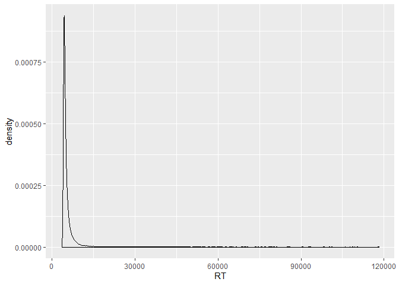
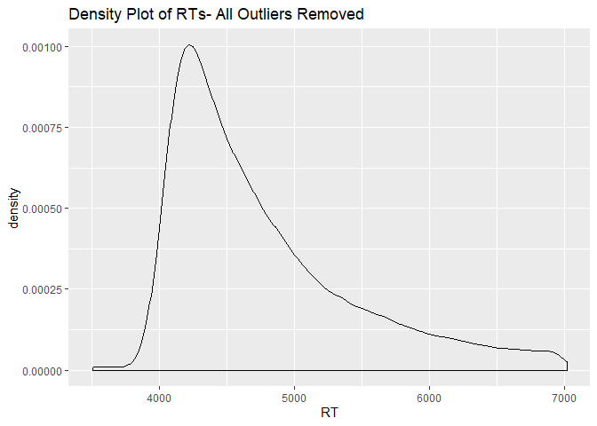
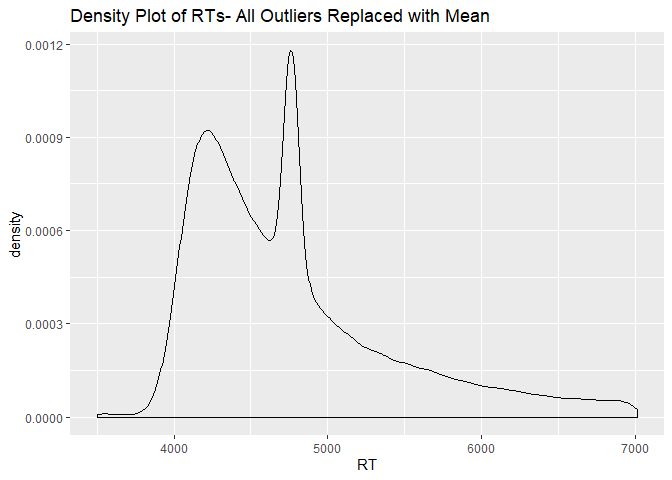
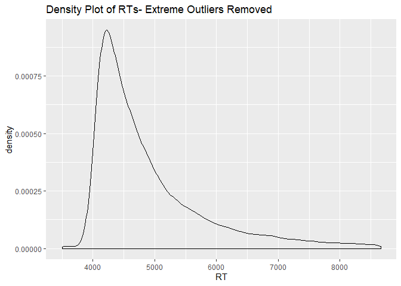
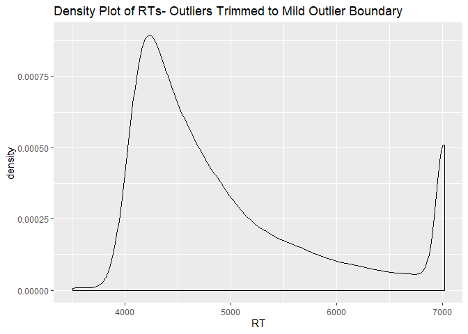
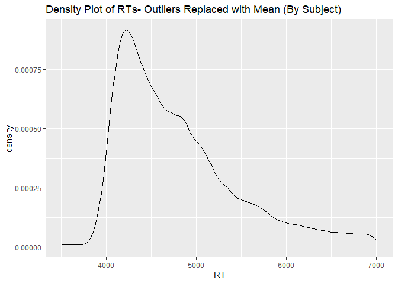

#### Loading Libaries


# Reading in, Cleaning, and Preparing our data

```r
#1 - Reading in the Raw Data
## Our data is in two formats because of a change in jsPsych version halfway through our data collection - thus we read those separate data file types (distinguishable by file size) in here separately, then combine them into a single large data frame

#1a - Specify our data folder for R
setwd("C:/Users/Alank/Documents/GitHub/Stekic-et-al/Data/50s/") 

#1b - Take the names of every file in our directory
files50  <- list.files(pattern = '\\.csv')

#1c - Read each raw data file (called by name from read.csv) into a lists of lists (an indexed list)
tables50 <- lapply(files50, read.csv, header = TRUE) 

#1d- Bind the lists of lists into a data frame
combined.df.50 <- do.call(rbind , tables50) 

#1e- removes \ from all of the columns of the dataframe (These only appear in the .50 files from the jsPsych Update)
combined.df.50[] <- lapply(combined.df.50, function(x) gsub("\\\\", "", x)) 

#1f- Repeat steps a-d for second data folder (files output by original jsPsych before update)

setwd("C:/Users/Alank/Documents/GitHub/Stekic-et-al/Data/40s/") 
files40  <- list.files(pattern = '\\.csv')
tables40 <- lapply(files40, read.csv, header = TRUE)
combined.df.40 <- do.call(rbind , tables40)

#1g -Make the column names of our two data frames the same so that they can be bound into a single data object
colnames(combined.df.50)<- c("rtD", "key_press", "trialtype2", "TrialIndex", "elapsed", "node_id", "viewhist", "responses", "Yoking", "RT", "RespKey", "RespCorr", "TrialType", "Image", "Label", "Location", "CorrectResponse", "Block", "BlockTrial", "Condition", "LabelType", "Subcondition", "TrialNum")


colnames(combined.df.40)<- c("rtD", "key_press", "trialtype2", "TrialIndex", "elapsed", "node_id", "viewhist", "responses", "Yoking", "RT", "RespKey", "RespCorr", "TrialType", "Image", "Label", "Location", "CorrectResponse", "Block", "BlockTrial", "Condition", "LabelType", "Subcondition", "TrialNum")
 
#1h - Binds our dataframes together 
combined.df <- rbind(combined.df.50, combined.df.40)

#1j- Substitute out some special characters
combined.df[] <- lapply(combined.df, function(x) gsub("\\\\", "", x))
combined.df[] <- lapply(combined.df, function(x) gsub("[{}]", "", x))
combined.df[] <- lapply(combined.df, function(x) gsub("\"", "", x))
```


```r
#2a- Add in a column with the biographical data (which is currently stored in a single value on the fourth line of each participant's file)
biodata <- combined.df[seq(4, nrow(combined.df), 246),]
biodata <- as.data.frame(biodata$responses)
colnames(biodata) <- "biodata"

biodata <- separate(biodata, col=biodata, into = c("Age", "Gender", "Specify"), sep = ",")

biodata$Age <- sub("age:", "", biodata$Age)
biodata$Gender <- sub("gender:", "", biodata$Gender)
biodata$Specify <- sub("specify:", "", biodata$Specify)

combined.df$Age <- rep(biodata$Age, each = 246)
combined.df$Gender <- rep(biodata$Gender, each = 246)

#2b- Add a unique participantID (actually the name of each file)
files <- c(files40, files50)
files <- sub(".csv", "", files)

combined.df$ParticipantID <- rep(files, each= 246)


#2c- Clean up our Data, Get rid of some useless columns, and re-sort the remaining columns into ones we will actually use
CleanData <- subset(combined.df, select = c("ParticipantID", "Condition", "Subcondition", "Yoking", "TrialNum", "TrialType", "Block", "BlockTrial", "Image", "Label", "Location", "CorrectResponse", "RespKey", "RespCorr", "RT"))

#2d- Get rid of extra lines from the jsPsych output- leaving us with only our Trial data (everything else of use we've extracted and added as columns)
CleanData <- subset(CleanData, TrialNum > 0)

#2e- Set the data types of our various columns
CleanData$ParticipantID <- as.factor(CleanData$ParticipantID)
CleanData$Condition <- as.factor(CleanData$Condition)
CleanData$Subcondition <- as.factor(CleanData$Subcondition)
CleanData$Yoking <- as.factor(CleanData$Yoking)
CleanData$TrialType <- as.factor(CleanData$TrialType)
CleanData$Location <- as.factor(CleanData$Location)

CleanData$TrialNum <- as.numeric(CleanData$TrialNum)
CleanData$Block <- as.numeric(CleanData$Block)
CleanData$BlockTrial <- as.numeric(CleanData$BlockTrial)
CleanData$RespCorr <- as.numeric(CleanData$RespCorr)
CleanData$RT <- as.numeric(CleanData$RT)
```


```r
#3a- Clean up our Data, Get rid of some useless columns, and re-sort the remaining columns into ones we will actually use
CleanData <- subset(combined.df, select = c("ParticipantID", "Condition", "Subcondition", "Yoking", "TrialNum", "TrialType", "Block", "BlockTrial", "Image", "Label", "Location", "CorrectResponse", "RespKey", "RespCorr", "RT"))

#3b- Get rid of extra lines from the jsPsych output- leaving us with only our Trial data (everything else of use we've extracted and added as columns)
CleanData <- subset(CleanData, TrialNum > 0)

#3c- Set the data types of our various columns
CleanData$ParticipantID <- as.factor(CleanData$ParticipantID)
CleanData$Condition <- as.factor(CleanData$Condition)
CleanData$Subcondition <- as.factor(CleanData$Subcondition)
CleanData$Yoking <- as.factor(CleanData$Yoking)
CleanData$TrialType <- as.factor(CleanData$TrialType)
CleanData$Location <- as.factor(CleanData$Location)

CleanData$TrialNum <- as.numeric(CleanData$TrialNum)
CleanData$Block <- as.numeric(CleanData$Block)
CleanData$BlockTrial <- as.numeric(CleanData$BlockTrial)
CleanData$RespCorr <- as.numeric(CleanData$RespCorr)
CleanData$RT <- as.numeric(CleanData$RT)
```

# Data Exclusion

We need to explore what data will be excluded from any further analysis off the top
Roughly we are looking for any irregularities in Reaction Time or other response data that we think would unduly affect our data

We remove data from participants for the following reasons:

A) 1 participant (ID # 7gtriiTixvBaQ) for which there was an 'NA' value in one of their response columns (we cannot be certain of the source of this 'NA' value so we remove their data entirely to be safe)

B) `r ` participants (IDs = )


```r
#4A- Excluding any participants for which there are NA values recorded

#i- Look for any 'NA' values in our Response Correctness column
CleanData[is.na(CleanData$RespCorr),]
```

```
##      ParticipantID Condition Subcondition Yoking TrialNum TrialType Block
## 9006 7gtriiTixvBaQ                                      1              NA
##      BlockTrial Image Label Location CorrectResponse RespKey RespCorr RT
## 9006         NA                                                    NA NA
```

```r
#ii- Remove participant for whom we have this impossible value
CleanData.RespCorr <- subset(CleanData, ParticipantID != "7gtriiTixvBaQ")

#4B- Excluding any participants with impossible RT values
## Preliminary inspection of data shows trials with negative response time values, which are obviously impossible
RTNegative <- subset(CleanData.RespCorr, RT < 0)

CleanData.RTNegCorr <- subset(CleanData.RespCorr, ParticipantID != "60CBPiTiO1gKw")
CleanData.RTNegCorr <- subset(CleanData.RTNegCorr, ParticipantID != "k3LHwiTiOx7fx")

# Verify that we have removed all negative values RT values from the data frame
RTNegative2 <- subset(CleanData.RTNegCorr, RT < 0)

#2B- Removing Participants with very large single RT values

RTHigh <- subset(CleanData.RespCorr, RT>120000 )

#Relevel this to get rid of factor levels that aren't there any longer
RTHigh$ParticipantID <- factor(RTHigh$ParticipantID)

RTHighs <- as.data.frame(table(RTHigh$ParticipantID))
colnames(RTHighs) <- c("Participant", "Count")

#re-order by count
RTHighs <- RTHighs[order(-RTHighs$Count),]

#Give shorter participantIDs
RTHighs$Participant <- substring(RTHighs$Participant, 1,3)

#Making the Participant Column into an Index
RTHighs2 <- RTHighs[-1]
row.names(RTHighs2) <- RTHighs$Participant

#Transpose for output
RTHighsT <- as.data.frame(t(RTHighs2))

#Get the participantIDs for participants with too-long RT values

participants <- unique(RTHigh$Participant)

#Write a for loop that removes all the lines of the data frame for each of these participants
CleanData.HighRTCorr <- CleanData.RTNegCorr

for (participant in participants) {
  
  CleanData.HighRTCorr <- subset(CleanData.HighRTCorr, ParticipantID != participant)
  
}

CleanData2 <- CleanData.HighRTCorr

#Output this clean Data to acsv
write.csv(CleanData2, file=("C:/Users/Alank/Documents/GitHub/Stekic-et-al/Data/CleanData.csv"))

# RT Histograms

ggplot(CleanData2, aes(RT)) +
  geom_density() #+
```

<!-- -->

```r
  #xlim(0, 40000)

#Calculating the interquartile range

lowerquart <- quantile(CleanData2$RT)[2]
upperquart <- quantile(CleanData2$RT)[4]

Interquartile <- upperquart - lowerquart

#Calculating thresholds
#Mild thresholds are 1.5* interquartile range
mild.low <- lowerquart - (Interquartile * 1.5)
mild.high <- upperquart + (Interquartile * 1.5)

#Extremes are 3* interquartile range
extreme.low <- lowerquart - (Interquartile * 3)
extreme.high <- upperquart + (Interquartile * 3)


#1- Removing all Outliers ()
CleanData.RTTrim1 <- subset(CleanData2, RT > mild.low & RT < mild.high)

ggplot(CleanData.RTTrim1, aes(RT)) +
  geom_density() +
  ggtitle("Density Plot of RTs- All Outliers Removed")
```

<!-- -->

```r
#2- Replacing all Outliers with the Mean
CleanData.RTTrim2 <- CleanData2

#Compute non-outlier means
NOMean1 <- mean(CleanData.RTTrim1$RT)

CleanData.RTTrim2$RT <- ifelse(CleanData.RTTrim2$RT < mild.low,
                               NOMean1,
                               CleanData.RTTrim2$RT)

CleanData.RTTrim2$RT <- ifelse(CleanData.RTTrim2$RT > mild.high,
                               NOMean1,
                               CleanData.RTTrim2$RT)


ggplot(CleanData.RTTrim2, aes(RT)) +
  geom_density() +
  ggtitle("Density Plot of RTs- All Outliers Replaced with Mean")
```

<!-- -->

```r
#3- Removing only extreme outliers

CleanData.RTTrim3 <- subset(CleanData2, RT > extreme.low & RT < extreme.high)

ggplot(CleanData.RTTrim3, aes(RT)) +
  geom_density() +
  ggtitle("Density Plot of RTs- Extreme Outliers Removed")
```

<!-- -->

```r
#4- Setting outliers to the most extreme of the minimum outlier values

CleanData.RTTrim4 <- CleanData2

CleanData.RTTrim4$RT <- ifelse(CleanData.RTTrim4$RT < mild.low,
                               mild.low,
                               CleanData.RTTrim4$RT)

CleanData.RTTrim4$RT <- ifelse(CleanData.RTTrim4$RT > mild.high,
                               mild.high,
                               CleanData.RTTrim4$RT)

ggplot(CleanData.RTTrim4, aes(RT)) +
  geom_density() +
  ggtitle("Density Plot of RTs- Outliers Trimmed to Mild Outlier Boundary")
```

<!-- -->

```r
#5- Replacing all outliers with the mean on a by-subject basis

participantIDs <- unique(CleanData2$ParticipantID)

participantdata <- list()
CleanData.RTTrim5 <- list()

for (participant in participantIDs) {
  
  participantdata <- subset(CleanData2, ParticipantID == participant)
  
  #Get Non-Outlier Mean
  participantdataNO <- subset(participantdata, RT > mild.low & RT < mild.high)
  NOMean2 <- mean(participantdataNO$RT)
  
  

  participantdata$RT <- ifelse(participantdata$RT < mild.low,
                               NOMean2,
                               participantdata$RT)

  participantdata$RT <- ifelse(participantdata$RT > mild.high,
                                NOMean2,
                               participantdata$RT)
  

  
  CleanData.RTTrim5 <- rbind(CleanData.RTTrim5, participantdata)

}


ggplot(CleanData.RTTrim5, aes(RT)) +
  geom_density() +
  ggtitle("Density Plot of RTs- Outliers Replaced with Mean (By Subject)")
```

<!-- -->

```r
CleanData3 <- CleanData.RTTrim5

#Splitting Testing Trials
participantIDs <- unique(CleanData3$ParticipantID)
participantdata <- list()
participantdata.training <- list()
participantdata.testing <- list()

testingtrials <- list()
trainingtrials <- list()


for (participant in participantIDs) {
  
  participantdata <- subset(CleanData3, ParticipantID == participant)
  participantdata.training <- subset(participantdata, TrialType == "Training")
  participantdata.testing <- subset(participantdata, TrialType == "Testing")
  
  
  TrainingFigures <- unique(participantdata.training$Image)
  
  participantdata.training$Generalisation <- NA
  
  participantdata.testing$Generalisation <- ifelse(
    participantdata.testing$Image %in% TrainingFigures,
    "Old",
    "New")
  
  trainingtrials <- rbind(trainingtrials, participantdata.training)
  testingtrials <- rbind(testingtrials, participantdata.testing)
  
  
}

CleanData4 <- rbind(trainingtrials, testingtrials)


#Factor levels, adding Trial Type 2

CleanData4$TrialType <- factor(CleanData4$TrialType, level = c ("Training", "Testing"))
CleanData4$TrialType2 <- paste(CleanData4$TrialType, CleanData4$Generalisation, sep = "-")
CleanData4$Generalisation <- as.factor(CleanData4$Generalisation)

CleanData4$TrialType2 <- factor(CleanData4$TrialType2, level = c ("Training-NA", "Testing-Old", "Testing-New"),
                                     labels = c("Training", "Testing-Old", "Testing-New"))


# Obtaining the curviness of images from our original script

CleanData4$Image <- sub("Stims/Figures/", "", CleanData4$Image)
CleanData4$Image <- sub(".bmp", "", CleanData4$Image)

CleanData4 <- separate(CleanData4, col=Image, into = c("ImageSeed", "JaggedvsCurved", "Curviness", "Set"), sep = "-")

write.csv(CleanData4, file=("C:/Users/Alank/Documents/GitHub/Stekic-et-al/Data/CleanData4.csv"))
```

# The Thesis (**OF DOOM**)


