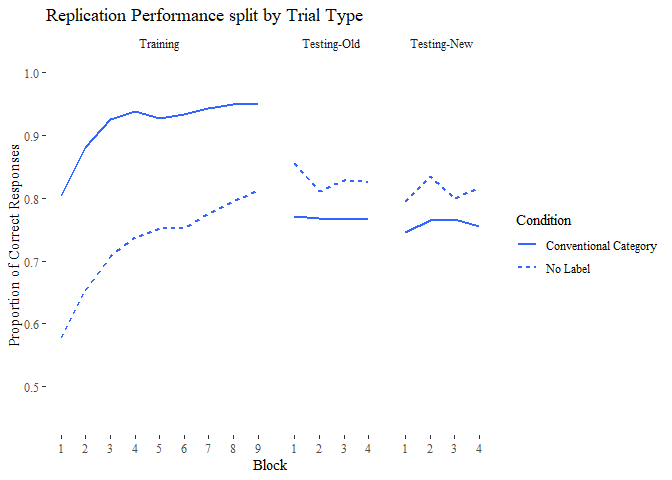
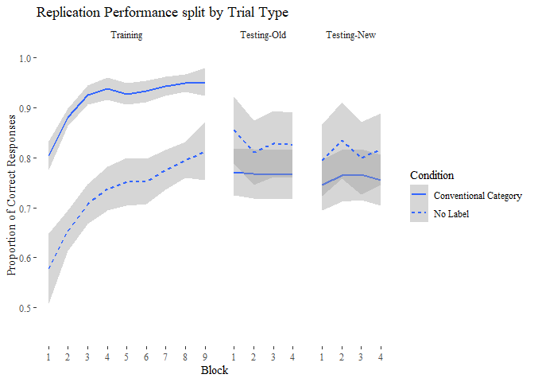

#Introduction

The following is data analysis for Stekic, Kovic, and Nielsen (2019), where we explored the learnability of artificial languages that differed in the relationship between those labels and the objects that they describe. All files for this experiment can be found at our [GitHub Repository](https://github.com/hecticdialectic/Stekic-et-al) and further details of the experimental design can be found at our OSF Repository.

Below in two code chunks we load libraries and read in our files. 

Note that in this document all code is "folded" by default- you can unfold sections (and look at the code) by clicking on the "Code" button on the Top Right of each block.

####Loading Libraries

```r
library(data.table)
library(tidyverse)
library(ggthemes)
library(outliers)
library(lme4)
library(lmerTest)
library(afex)
library(kableExtra)
```

####Loading Data

```r
#Replace with your own path. File attached
CleanData2 <- read.csv("C:/Users/Alan/Documents/GitHub/Stekic-et-al/Data/CleanData4.csv")

CleanData3 <- subset(CleanData2, Condition == "3A"|Condition == "3B"|Condition == "10")

#Get rid of subconditions
CleanData3$Condition <- factor(CleanData3$Condition,
                            levels= c("3A", "3B", 10),
                            labels = c("Conventional Category","Conventional Category","No Label"))

#Relevel Trial Type 2
CleanData3$TrialType2 <- factor(CleanData3$TrialType2,
                            levels= c("Training", "Testing-Old", "Testing-New"))
```

#Damian This is the Graph we are trying to model the stats for
####Exploring the Test Trial Failure

```r
Rep2007Agg3 <- aggregate(RespCorr ~ Condition + TrialType2 + Block + ParticipantID , data=CleanData3, mean, na.rm= FALSE)

Rep2007Agg3$Block <- factor(Rep2007Agg3$Block)

ggplot(data=Rep2007Agg3, aes(x=Block, y=RespCorr, group= Condition)) +
  #geom_line(aes(color= Condition)) +
  #geom_point(size=1.75, aes(colour = Condition)) +
  geom_smooth(method='loess', formula= y ~ x, se= FALSE, aes(linetype = Condition)) +
 # scale_linetype_manual(values = c("solid", "solid", "solid",
  #                        "longdash", "longdash", "longdash", "dotdash",
  #                        "dotted")) +
  scale_color_manual(values= c("#0066CC", "#CC0033","#33FF00", "#0066CC", "#CC0033","#33FF00", "#33FF00", "#000000")) +
  labs(x="Block", y="Proportion of Correct Responses") +
  scale_y_continuous(limits = c(0.45,1), breaks=c(0.5,0.6,0.7,0.8,0.9,1.0)) +
  facet_grid(~TrialType2, scales="free", space= "free_x") +
  theme_tufte() +
  ggtitle("Replication Performance split by Trial Type")
```

<!-- -->

```r
#Add another with variance

ggplot(data=Rep2007Agg3, aes(x=Block, y=RespCorr, group= Condition)) +
  #geom_line(aes(color= Condition)) +
  #geom_point(size=1.75, aes(colour = Condition)) +
  geom_smooth(method='loess', formula= y ~ x, se= TRUE, aes(linetype = Condition)) +
 # scale_linetype_manual(values = c("solid", "solid", "solid",
  #                        "longdash", "longdash", "longdash", "dotdash",
  #                        "dotted")) +
  scale_color_manual(values= c("#0066CC", "#CC0033","#33FF00", "#0066CC", "#CC0033","#33FF00", "#33FF00", "#000000")) +
  labs(x="Block", y="Proportion of Correct Responses") +
  scale_y_continuous(limits = c(0.45,1), breaks=c(0.5,0.6,0.7,0.8,0.9,1.0)) +
  facet_grid(~TrialType2, scales="free", space= "free_x") +
  theme_tufte() +
  ggtitle("Replication Performance split by Trial Type")
```

<!-- -->

This interpretation is supported by breaking apart the data and looking at the two types of testing trials separately.

For participants in the no-label condition, Testing Trials differ from Training Trials only in the lack of feedback given and the introduction of new exemplars to generalise to. Unsurprisingly, they find Old (familiar) images easier than new images which they have to generalise to (which they get better at).

Participants in the Conventional Category label condition however don't show this- performance on all testing trials falls off the cliff and there are no differences between familiar and new images - this suggests that they are actually learning very little about the image categories.

#Damian this is where we try to run the stats
####Full Model of 2007 Replication

```r
#Recoding "block" such that testing blocks are distinct from training blocks (currently blocks 1-4 are treated as identical statistically)
CleanData3$Block <- ifelse(CleanData3$TrialType == "Testing",
                           CleanData3$Block + 9,
                           CleanData3$Block)

#Refactoring to drop unused levels
#CleanData5$Block <- factor(CleanData5$Block)  #Not sure whether block should be numeric or a factor
CleanData3$ParticipantID <- factor(CleanData3$ParticipantID)

#Specifying a First model and looking at the results- Note this model FAILS TO CONVERGE
#Rep2007.Model1 <- glmer(RespCorr ~ Condition + TrialType2 + Block + Curviness +  #Fixed Efffects (no interactions)
 #                           (1|ParticipantID), #Random intercept for participantID
 #                         data=CleanData3, 
 #                        family= "binomial")

#summary(Rep2007.Model1)


#Specifying a more complex model THIS MODEL ALSO FAILS TO CONVERGE
#Rep2007.Model2 <- glmer(RespCorr ~ Condition * TrialType2 + Condition * Block + Curviness +  #Fixed Efffects (wiht interactions of Condition x Trial Type and Condition x Bock)
  #                          (1|ParticipantID), #Random intercept for participantID
   #                       data=CleanData3, 
    #                      family= "binomial")

#summary(Rep2007.Model2)

#Curviness is not massively central to our replication, so lets drop it and see if we can get a model to converge NOPE IT DOESN"T CONVERGE EITHER
#Rep2007.Model3 <- glmer(RespCorr ~ Condition * TrialType2 * Block +  #Fixed Efffects (wiht interactions of Condition x Trial Type and Condition x Bock)
 #                           (1|ParticipantID), #Random intercept for participantID
  #                        data=CleanData3, 
   #                       family= "binomial")

#summary(Rep2007.Model3)

#Lets remove our three-way interaction
#And rescale and center our dependent variable


Rep2007.Model4 <- glmer(RespCorr ~ Condition * TrialType2 + Condition * Block +  #Fixed Efffects (wiht interactions of Condition x Trial Type and Condition x Bock)
                            (1|ParticipantID), #Random intercept for participantID
                          data=CleanData3, 
                          family= binomial)
```

```
## Warning in checkConv(attr(opt, "derivs"), opt$par, ctrl = control
## $checkConv, : Model failed to converge with max|grad| = 0.00133055 (tol =
## 0.001, component 1)
```

```r
summary(Rep2007.Model4)
```

```
## Generalized linear mixed model fit by maximum likelihood (Laplace
##   Approximation) [glmerMod]
##  Family: binomial  ( logit )
## Formula: RespCorr ~ Condition * TrialType2 + Condition * Block + (1 |  
##     ParticipantID)
##    Data: CleanData3
## 
##      AIC      BIC   logLik deviance df.resid 
##  21690.4  21763.3 -10836.2  21672.4    24231 
## 
## Scaled residuals: 
##      Min       1Q   Median       3Q      Max 
## -12.4175   0.0913   0.3025   0.5020   1.9964 
## 
## Random effects:
##  Groups        Name        Variance Std.Dev.
##  ParticipantID (Intercept) 1.232    1.11    
## Number of obs: 24240, groups:  ParticipantID, 101
## 
## Fixed effects:
##                                         Estimate Std. Error z value
## (Intercept)                              1.93527    0.14966  12.931
## ConditionNo Label                       -1.98629    0.25404  -7.819
## TrialType2Testing-Old                   -2.44662    0.09649 -25.357
## TrialType2Testing-New                   -2.44663    0.10275 -23.811
## Block                                    0.11755    0.01178   9.981
## ConditionNo Label:TrialType2Testing-Old  2.18350    0.14296  15.274
## ConditionNo Label:TrialType2Testing-New  1.85696    0.15553  11.940
## ConditionNo Label:Block                  0.04417    0.01725   2.561
##                                         Pr(>|z|)    
## (Intercept)                              < 2e-16 ***
## ConditionNo Label                       5.34e-15 ***
## TrialType2Testing-Old                    < 2e-16 ***
## TrialType2Testing-New                    < 2e-16 ***
## Block                                    < 2e-16 ***
## ConditionNo Label:TrialType2Testing-Old  < 2e-16 ***
## ConditionNo Label:TrialType2Testing-New  < 2e-16 ***
## ConditionNo Label:Block                   0.0104 *  
## ---
## Signif. codes:  0 '***' 0.001 '**' 0.01 '*' 0.05 '.' 0.1 ' ' 1
## 
## Correlation of Fixed Effects:
##             (Intr) CndtNL TT2T-O TT2T-N Block  CNL:TT2T-O CNL:TT2T-N
## ConditnNLbl -0.589                                                  
## TrlTyp2Ts-O  0.209 -0.123                                           
## TrlTyp2Ts-N  0.197 -0.116  0.813                                    
## Block       -0.349  0.206 -0.856 -0.804                             
## CnNL:TT2T-O -0.141  0.189 -0.675 -0.549  0.578                      
## CnNL:TT2T-N -0.130  0.174 -0.537 -0.661  0.531  0.723               
## CndtnNLbl:B  0.239 -0.312  0.584  0.549 -0.683 -0.816     -0.753    
## convergence code: 0
## Model failed to converge with max|grad| = 0.00133055 (tol = 0.001, component 1)
```

```r
#use step to simplify model

#stepFirst <- step(ArbData.Model1)
#ArbData.Model2 <- get_model(stepFirst)
#summary(ArbData.Model2)
```


